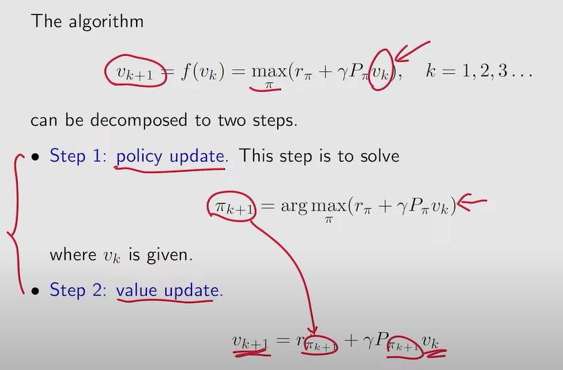

# Value Iteration and Policy Iteration Algorithm

## Value Iteration Algorithm

Value Iteration is a **Dynamic Programming algorithm** used to find the **optimal value function $v_{k+1}$** and consequently the **optimal policy $\pi$** in Markov Decision process (MDP)i

It works by **repeatedly applying the Bellman Optimality Update** until convergence.

## Policy Iteration Algorithm

Policy Iteration is also a **Dynamic Programming algorithm** to solve MDP. It alternates between 2 steps

1. Policy evaluation - Computes the Value Fonction( $v$) for the current Policy( $\pi$).
2. Policy improvement - Update the policy by choosing the action that maximizes the reward

Repeats itself until the policy stabilizes

### Difference

- **Value Iteration** updates values until convergence, then extracts policy once.
- **Policy Iteration** repeatedly alternates between policy evaluation & improvement, often converging faster in practice.

## Truncated Policy Iteration Algorithm

**in Policy Iteration** - Policy Evaluation is run until convergence

**in Value Iteration** - Policy Evaluation is never run fully

**in Truncated Policy Iteration** - Instead of fully evaluating the policy, you **do only a limited number of policy evaluation steps** before doing policy improvement.

### Why use TPI

- **Full PI**: Expensive evaluation step (solving big system of equations).
- **VI**: Many iterations, but cheaper each time.
- **TPI**: A trade-off — you save computation by not fully evaluating policies, while still improving policies more efficiently than VI.
